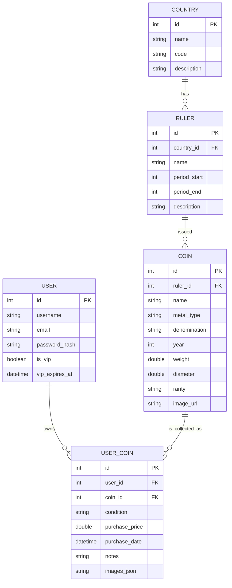
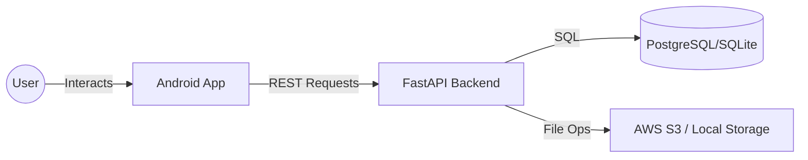

# CoinSet Application - Developer Documentation

## 1. Full Logic of the App

CoinSet is a mobile application for numismatists (coin collectors). It provides a comprehensive catalog of coins, currently focusing on the Russian Empire, and allows users to manage their personal collections.

### Core Features:
- **Catalog Browsing:** Users can navigate through a hierarchy of Countries -> Rulers -> Categories -> Denominations -> Coin Types.
- **Search & Discovery:** Search for specific countries or coins. If a country is missing, users can "wishlist" it.
- **Personal Collection:** Authenticated users can add coins from the catalog to their personal "My Collection" list, specifying condition and notes.
- **Authentication:** JWT-based authentication system for secure access to user-specific data.
- **VIP Features:** Advanced features like photo uploads for collection items and detailed statistics are reserved for VIP users.
- **Data Synchronization:** The app syncs with a FastAPI backend, providing real-time access to the coin database.

---

## 2. ERD Model (Entity-Relationship Diagram)

The following diagram describes the database structure used by the FastAPI backend:

---

## 3. DFD Model (Data Flow Diagram)

### Level 0: High-Level Overview

### Level 1: Key Processes
1. **Authentication Process:**
   - User provides credentials.
   - App sends `POST /api/auth/login`.
   - API validates against DB and returns JWT (Access + Refresh).
   - App stores tokens in `DataStore`.

2. **Catalog Retrieval:**
   - App sends `GET /api/countries?include=rulers`.
   - API fetches data from DB with joins.
   - API returns JSON list.
   - App renders UI using Jetpack Compose.

3. **Collection Management:**
   - User adds coin to collection.
   - App sends `POST /api/user-coins` with JWT in Header.
   - API verifies token and saves record to `USER_COIN` table.

4. **Image Upload (VIP):**
   - User selects image.
   - App sends `POST /api/user-coins/{id}/upload-image`.
   - API checks VIP status in DB.
   - API saves file to Storage and updates `images` field in DB.

---

## 4. Integration Details (Keys & URLs)

- **API Base URL:**
  - Local Emulator: `http://10.0.2.2:8000/`
  - Physical Device: `http://<YOUR_LOCAL_IP>:8000/`
  - Production (AWS): `http://your-production-url.com/`
- **Configuration File:** All API connection settings are located in `com.example.coinset.api.RetrofitClient`.
- **Security:** Authentication is handled via the `Authorization: Bearer <JWT>` header, automatically managed by `authInterceptor` in `RetrofitClient`.
